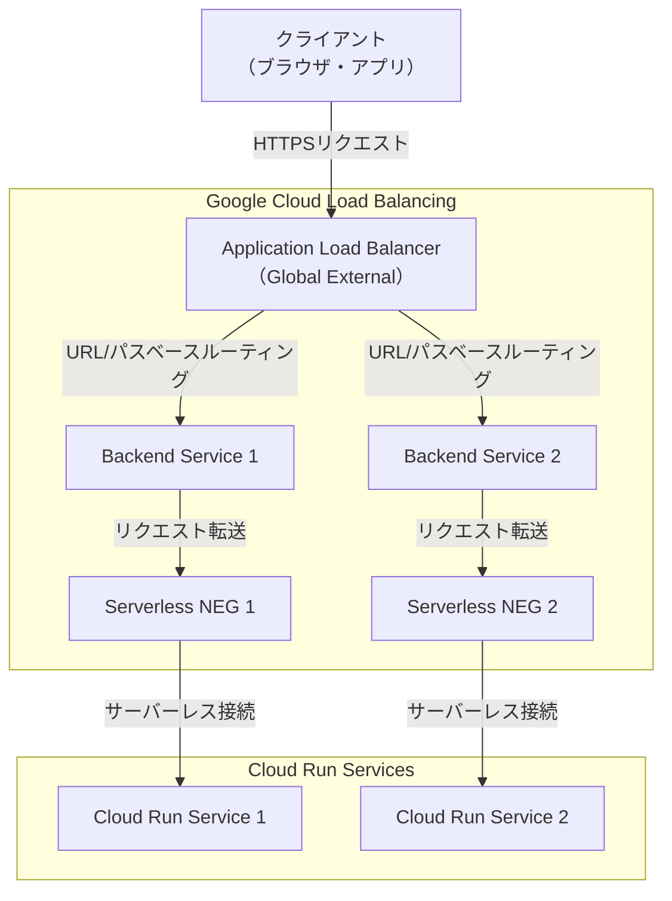

Architecting with Google Compute Engine - Day 2

# ロードバランシングと自動スケーリング

Google CloudのLBはグローバルとリージョナルに分かれていて、さらにその中にも複数の種類があります。
全部の使い方を覚える必要はほとんどありません。
最もよく利用する `Global External Application LoadBalancer`をまずは理解して、他のものは必要に応じて使えばよいです。

厄介なことに、`Global External Application LoadBalancer`と似たようなものに講義スライドで HTTP(S)ロードバランシングと表記されるものがあります。
このHTTP(S)LBは昔利用されていたもので、`Global External Application LoadBalancer`の方が高機能であるため、現代では通常利用することはありません。

※ 少し発展的なことを書いておくと、KuberneesのIngressで起動するのはHTTP(S)ロードバランシングです。
`Global External Application LoadBalancer`とその機能を利用したい場合はGatewayを利用します。

## マネージドインスタンスグループ

VMインスタンスを起動するテンプレートに基づいて、VMインスタンスのCPU使用率などに基づいた自動スケーリングを行います。
VMインスタンスで実行されるワークロードは極力登場させないことが理想であるため、実際はほとんど利用しません。
可能な限りCloud Runのようなサーバーレスなワークロードに寄せるか、Cloud Runで実行できないものはKubernetesで実行しましょう。

※ 実はGoogle CloudのKubernetesクラスタはこのマネージドインスタンスグループの仕組みの上に成り立っているので、
そういう裏側の部分で利用することはあります。

## Application LoadBalancing

HTTPリクエストをルールに基づいてBackend Serviceに転送します。

Backend Serviceに設定できるものは

- マネージドインスタンスグループ
- Cloud Run
- Cloud Functions
- App Engine
- Kubernetesで定義されているService

などがあります。Cloud Runを指定することがとても多く、これは Serverless Network Endpoint Groupという機能によって実現されます。



## SSL証明書

Application Load BalancerにはSSL証明書をインストールできます。
自分の所有するSSL証明書を利用できる他、おすすめはGoogleが発行や更新を行ってくれるマネージド証明書を活用することです。
Certificate Managerというサービスを活用することで、所有するドメインであればワイルドカード証明書も発行できます。

※ 裏技ですが、ドメインを所有していなくてもCloud Endpointsというプロダクトを活用すれば、Certificate Managerを活用して
`<任意の名前>.endpoints.<project_id>.cloud.goog` というドメインのSSL証明書を発行できます。
本番環境ではないHTTPSが必要な開発用途で頻繁に活用しています。
エンドユーザーの目に触れる部分でなければ本番用途でも活用します。

## Cloud CDN

Application Load Balancerを経由して配信されるコンテンツをGoogleのキャッシュに保存することにより、
費用を削減しながら高速に配信が可能になります。
特に大量に画像や動画を配信するようなケースにおいて、Cloud Storageに保存されたコンテンツを高速に配信できるようになります。

## Cloud CDNの3つのキャッシュモード

Cloud CDNには以下の3つのキャッシュモードがあり、アプリケーションの特性に応じて適切なモードを選択する必要があります。

| 項目                  | CACHE_ALL_STATIC                           | USE_ORIGIN_HEADERS                               | FORCE_CACHE_ALL                    |
| --------------------- | ------------------------------------------ | ------------------------------------------------ | ---------------------------------- |
| **概要**              | 静的ファイル拡張子を自動認識してキャッシュ | Origin のCache-Controlヘッダーに従ってキャッシュ | すべてのコンテンツを強制キャッシュ |
| **Cache-Control扱い** | 無視                                       | 尊重                                             | 無視                               |
| **デフォルトTTL**     | 3600秒（1時間）                            | Originヘッダーに依存                             | 3600秒（1時間）                    |
| **設定難易度**        | 簡単                                       | 中程度                                           | 簡単                               |
| **推奨環境**          | 開発・小規模サイト                         | 本番環境                                         | 特殊用途                           |

### 主要なユースケース

| キャッシュモード       | 適用場面               | 具体例                                                                                           |
| ---------------------- | ---------------------- | ------------------------------------------------------------------------------------------------ |
| **CACHE_ALL_STATIC**   | 静的コンテンツ中心     | • 静的Webサイト<br/>• SPA のアセット配信<br/>• 画像・動画配信<br/>• 変更頻度の低い公開サイト     |
| **USE_ORIGIN_HEADERS** | 動的・複合コンテンツ   | • RESTful API<br/>• CMSベースサイト<br/>• ECサイト<br/>• マイクロサービス                        |
| **FORCE_CACHE_ALL**    | 読み取り専用コンテンツ | • 読み取り専用API<br/>• 静的サイトジェネレーター<br/>• アーカイブサイト<br/>• ドキュメントサイト |

### メリット・デメリット比較

| 項目           | CACHE_ALL_STATIC                                            | USE_ORIGIN_HEADERS                                          | FORCE_CACHE_ALL                                                                         |
| -------------- | ----------------------------------------------------------- | ----------------------------------------------------------- | --------------------------------------------------------------------------------------- |
| **メリット**   | ✅ 設定が簡単<br/>✅ 静的ファイル自動認識<br/>✅ 初心者向け | ✅ 最も柔軟な制御<br/>✅ コンテンツ別最適化<br/>✅ 本番推奨 | ✅ 最大キャッシュ効率<br/>✅ Origin負荷最小<br/>✅ 最高速度                             |
| **デメリット** | ❌ 動的コンテンツ非対応<br/>❌ 制御の柔軟性が低い           | ❌ Origin側設定が必要<br/>❌ 設定ミスのリスク               | ❌ 動的コンテンツも強制キャッシュ<br/>❌ リアルタイム性に不適切<br/>❌ パージ頻度が高い |

### Cache-Controlヘッダー設定例（USE_ORIGIN_HEADERS用）

```http
# 30分キャッシュ
Cache-Control: public, max-age=1800

# キャッシュしない
Cache-Control: no-cache, no-store, must-revalidate

# 条件付きキャッシュ（CDN用TTLを個別設定）
Cache-Control: public, max-age=3600, s-maxage=7200
```

## ネットワークロードバランシング

プロキシしないロードバランサーなので、アクセス元IPアドレスがそのままVPCネットワークに伝達され、ファイアウォールルールによる制御を受けます。
プロキシするロードバランサーはGoogle Front End(GFE)を経由したアクセスとなります。
そのため、VMインスタンスなどVPCネットワークに配置したリソースを使用する場合は、GFEのIPアドレス `130.211.0.0/22`と `35.191.0.0/16` の許可が必要です。

## 内部ロードバランシング

リージョン内部でトラフィックをルーティングします。
インターネットに出る必要のないトラフィックをGoogle Cloud内部でロードバランシングできます。
昔はサービスメッシュの構築に採用していましたが、[Cloud Service Mesh](https://cloud.google.com/products/service-mesh)というサービスの登場により、利用される機会は減りました。

# インフラストラクチャの自動化

## Terraform

クラウドインフラの構築をコードで記述できる代表的なOSSです。
GitHub Actionsなどを利用したCICDパイプラインと併用することで、インフラの変更にレビューと承認のプロセスが生まれます。
すべてをTerraformで管理しようとするのではなく、構築の冪等性が重要であったり、変更頻度が高いリソースに対して部分的に適用することを個人的におすすめします。

# マネージドサービス

## BigQuery

Google Cloudというのは、基本的にはBigQueryを中心に据えたエコシステムだと思っています。
それほどBig Queryというのは様々な用途で非常に重要です。
SQLを実行してデータを分析するだけではなく、生成AIによるテキストの生成や、コンテンツのエンベディングとベクトル検索など、
近年注目されがちな機能のほとんどを担うことができます。

BigQueryを制するものがGoogle Cloudを制す、と言っても過言ではない、かもしれません。

## Dataflow

Dataflowを知るためには、まず[Apache Beam](https://beam.apache.org/)というOSSを知ることが重要です。
Apache Beamはデータのバッチ処理とストリーミング処理を同一のコードで実装できるOSSであり、これをDataflowで実行することで様々な良いことがあります。
詳しくはData Engineeringのコースでお話することになります。

## Dataprep

データを活用するためには、事前にデータをクレンジングして整理することが非常に重要です。
Dataprepは、GUIによるデータの確認とクレンジング環境を提供します。

## Dataproc

オンプレミスや他のパブリッククラウドではまだまだSpackやHadoopで実行されるジョブがあるかもしれません。
そのようなジョブをGoogle Cloudに移行して実行するために、Dataprocという選択肢が用意されています。
